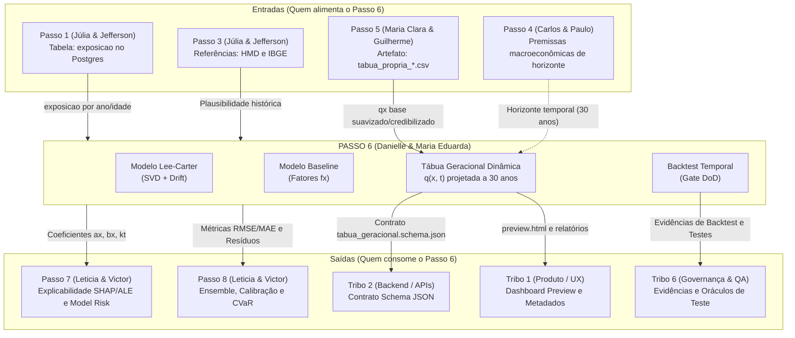

# Contratos de Comunicação Interpassos — Passo 6

**Dupla Responsável:** Danielle Soares da Silva e Maria Eduarda Quaresma de Andrade  
**Bloco do Escopo:** Tábuas Geracionais e Improvement (§6)  
**Objetivo:** Especificar formalmente os pontos de entrada, saída e consumo direto entre o Passo 6 e todos os outros passos da Tribo 3, bem como as integrações intertribos.

> **Status desta rodada — construído e testado.** As Entradas (seção 2) já
> estavam implementadas. As Saídas pra Passo 7/8 (seção 3.1/3.2) agora
> também existem de verdade em `contracts/api_modelos.py`
> (`obter_parametros_para_passo7()` e `obter_dados_para_passo8()`), com 12
> testes em `tests/test_api_modelos.py` rodando contra a série real do
> IBGE. O schema da seção 3.3 existe em
> `contracts/tabua_geracional.schema.json`, validado contra as 1.581
> linhas de um CSV real (`tests/test_tabua_geracional_schema.py`) — nenhum
> dos dois foi só escrito e assumido correto.
>
> **Uma correção de caminho de import**: o projeto não é instalado como
> pacote (não há `setup.py`/`pyproject.toml`), então
> `tabuas_geracionais_improvement.contracts.api_modelos` (como os exemplos
> abaixo diziam originalmente) não resolve. O import real, consistente com
> o resto do projeto (`from dados.ingestao_passos import ...` em
> `scripts/`), é `from contracts.api_modelos import ...` a partir da raiz
> de `tabuas-geracionais-improvement/`.

---

## 1. Mapa de Integração do Passo 6



---

## 2. Especificação das Entradas (Upstream)

### 2.1. Do Passo 1: Dados de Exposição ao Risco (`ambiente-de-dados`)
- **Canal de Comunicação:** Conexão direta PostgreSQL (`tribo3`, porta 5433).
- **Tabela:** `exposicao` (produzida após aprovação nas 9 regras de qualidade R01–R09).
- **Campos consumidos:**
  - `ano_calendario` (INTEGER): Agregação temporal da série histórica.
  - `idade_exata` (DECIMAL): Arredondada via `FLOOR(idade_exata)` para agrupar células.
  - `tempo_exposto` (DECIMAL): Soma para formar a exposição central ao risco ($E_{x,t}$).
  - `tipo_saida` (ENUM): Filtro `WHERE tipo_saida = 'obito'` para contagem de mortes observadas ($D_{x,t}$).

### 2.2. Do Passo 5: Tábua Biométrica Própria (`tabua-biometrica-propria`)
- **Canal de Comunicação:** Leitura de artefato consolidado em `tabua-biometrica-propria/docs/tabua_propria/tabua_propria_*.csv`.
- **Campos consumidos:**
  - `idade`: Chave primária etária.
  - `qx_credibilizado`: Probabilidade de morte credibilizada da população que serve como taxa âncora no ano base $q(x, t_0)$.
- **Efeito no Passo 6:** Sobre esse $q_x(t_0)$ consolidado da experiência da Tribo 3 é aplicada a projeção de longevidade:
  $$q(x, t_0 + h) = q_{x, t_0} \times (1 - f_x)^h$$

---

## 3. Especificação das Saídas (Downstream)

### 3.1. Para o Passo 7: Explicabilidade (SHAP/ALE) e Model Risk
- **Responsáveis:** Leticia Arisa Kobayashi Higa e Victor Pontual Guedes Arruda Nóbrega.
- **Como consomem (construído e testado nesta rodada):**
  ```python
  # a partir da raiz de tabuas-geracionais-improvement/
  from contracts.api_modelos import obter_parametros_para_passo7

  dados_passo7 = obter_parametros_para_passo7()
  # Retorna dicionário estruturado com:
  # - idades / anos_historicos: eixos de alinhamento das listas abaixo
  # - alpha_x: perfil médio de mortalidade por idade
  # - beta_x: sensibilidade etária a choques de longevidade
  # - kappa_t: trajetória histórica do índice temporal
  # - drift: taxa anual de tendência estimada
  # - variancia_explicada, origem_dados
  ```
- **Uso no Passo 7:** Geração de valores SHAP e curvas ALE para explicar nos dashboards da Tribo 1 o que mais influencia a sobrevida dos participantes.

### 3.2. Para o Passo 8: Ensemble, Calibração e Incerteza (CVaR)
- **Como consomem (construído e testado nesta rodada):**
  ```python
  from contracts.api_modelos import obter_dados_para_passo8

  dados_passo8 = obter_dados_para_passo8()
  # Retorna:
  # - modelo_campeao, justificativa, anos_treino, anos_holdout
  # - metricas_baseline / metricas_lee_carter: rmse, mae, mape, chi2_obitos, n_celulas
  # - previsoes_holdout_campeao: lista célula a célula (idade, ano, q_observado,
  #   q_previsto, obitos, exposicao) do modelo campeão no holdout
  ```
- **Uso no Passo 8:** Comparação de modelos *Challengers*, combinação em *Ensemble* e cálculo de Value-at-Risk Condicional (CVaR) para estresse de solvência.

### 3.3. Para a Tribo 2 (Arquitetura e Backend): Contrato de Schema
- **Arquivo de Contrato:** [`contracts/tabua_geracional.schema.json`](../contracts/tabua_geracional.schema.json) — criado nesta rodada e validado contra as 1.581 linhas de um CSV real gerado pela pipeline (`tests/test_tabua_geracional_schema.py`). O link original apontava para um caminho absoluto da máquina de um dev específico (`c:/Users/tarta/...`), que nunca existiu neste repositório.
- **Garantia:** Respeita o padrão JSON Schema (draft 2020-12) para validação de contratos em APIs REST (`/api/v1/biometria/tabua-geracional`).

### 3.4. Para a Tribo 1 (Produto e UX): Dashboards
- **Arquivo de Interface:** [`dashboard/preview.html`](../dashboard/preview.html) — esse já existe e é gerado por `dashboard/gerar_preview.py` a cada rodada do `pipeline.py`.
- **Conteúdo:** Apresentação visual limpa, indicadores sem jargão técnico e mapa de calor interativo de coortes.
