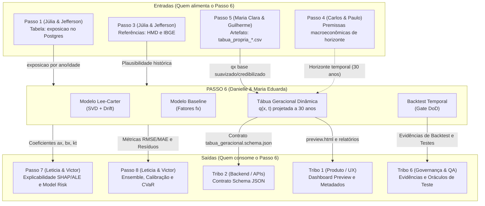

# Contratos de Comunicação Interpassos — Passo 6

**Dupla Responsável:** Danielle Soares da Silva e Maria Eduarda Quaresma de Andrade  
**Bloco do Escopo:** Tábuas Geracionais e Improvement (§6)  
**Objetivo:** Especificar formalmente os pontos de entrada, saída e consumo direto entre o Passo 6 e todos os outros passos da Tribo 3, bem como as integrações intertribos.

---

## 1. Mapa de Integração do Passo 6



---

## 2. Especificação das Entradas (Upstream)

### 2.1. Do Passo 1: Dados de Exposição ao Risco (`ambiente-de-dados`)
- **Canal de Comunicação:** Conexão direta PostgreSQL (`tribo3`, porta 5433).
- **Tabela:** `exposicao` (produzida após aprovação nas 9 regras de qualidade R01–R09).
- **Campos consumidos:**
  - `ano_calendario` (INTEGER): Agregação temporal da série histórica.
  - `idade_exata` (DECIMAL): Arredondada via `FLOOR(idade_exata)` para agrupar células.
  - `tempo_exposto` (DECIMAL): Soma para formar a exposição central ao risco ($E_{x,t}$).
  - `tipo_saida` (ENUM): Filtro `WHERE tipo_saida = 'obito'` para contagem de mortes observadas ($D_{x,t}$).

### 2.2. Do Passo 5: Tábua Biométrica Própria (`tabua-biometrica-propria`)
- **Canal de Comunicação:** Leitura de artefato consolidado em `tabua-biometrica-propria/docs/tabua_propria/tabua_propria_*.csv`.
- **Campos consumidos:**
  - `idade`: Chave primária etária.
  - `qx_credibilizado`: Probabilidade de morte credibilizada da população que serve como taxa âncora no ano base $q(x, t_0)$.
- **Efeito no Passo 6:** Sobre esse $q_x(t_0)$ consolidado da experiência da Tribo 3 é aplicada a projeção de longevidade:
  $$q(x, t_0 + h) = q_{x, t_0} \times (1 - f_x)^h$$

---

## 3. Especificação das Saídas (Downstream)

### 3.1. Para o Passo 7: Explicabilidade (SHAP/ALE) e Model Risk
- **Responsáveis:** Leticia Arisa Kobayashi Higa e Victor Pontual Guedes Arruda Nóbrega.
- **Como consomem:** Importam diretamente via módulo Python:
  ```python
  from tabuas_geracionais_improvement.contracts.api_modelos import obter_parametros_para_passo7

  dados_passo7 = obter_parametros_para_passo7()
  # Retorna dicionário estruturado com:
  # - alpha_x: perfil médio de mortalidade por idade
  # - beta_x: sensibilidade etária a choques de longevidade
  # - kappa_t: trajetória histórica do índice temporal
  # - drift: taxa anual de tendência estimada
  ```
- **Uso no Passo 7:** Geração de valores SHAP e curvas ALE para explicar nos dashboards da Tribo 1 o que mais influencia a sobrevida dos participantes.

### 3.2. Para o Passo 8: Ensemble, Calibração e Incerteza (CVaR)
- **Como consomem:** Importam diretamente via:
  ```python
  from tabuas_geracionais_improvement.contracts.api_modelos import obter_dados_para_passo8

  dados_passo8 = obter_dados_para_passo8()
  # Retorna:
  # - métricas de erro fora da amostra (RMSE, MAE, MAPE, Chi2)
  # - previsões vs observados no período holdout
  ```
- **Uso no Passo 8:** Comparação de modelos *Challengers*, combinação em *Ensemble* e cálculo de Value-at-Risk Condicional (CVaR) para estresse de solvência.

### 3.3. Para a Tribo 2 (Arquitetura e Backend): Contrato de Schema
- **Arquivo de Contrato:** [`contracts/tabua_geracional.schema.json`](file:///c:/Users/tarta/Documents/Faculdade/Materias/EPS/EPS_Tribo_03/tabuas-geracionais-improvement/contracts/tabua_geracional.schema.json)
- **Garantia:** Respeita o padrão JSON Schema para validação de contratos em APIs REST (`/api/v1/biometria/tabua-geracional`).

### 3.4. Para a Tribo 1 (Produto e UX): Dashboards
- **Arquivo de Interface:** [`dashboard/preview.html`](file:///c:/Users/tarta/Documents/Faculdade/Materias/EPS/EPS_Tribo_03/tabuas-geracionais-improvement/dashboard/preview.html)
- **Conteúdo:** Apresentação visual limpa, indicadores sem jargão técnico e mapa de calor interativo de coortes.
